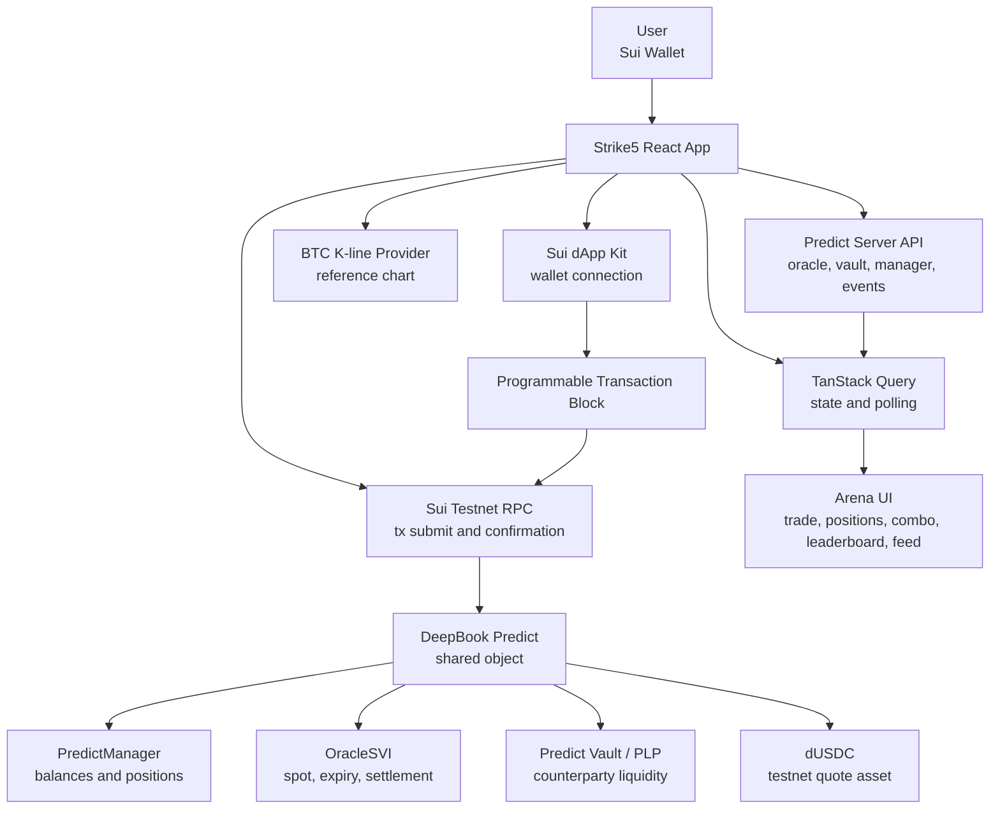

# Strike5


**Strike5 is a short-cycle BTC prediction arena powered by DeepBook Predict on Sui.**

Users open fixed-risk BTC Above, Below, or Range positions with dUSDC, track live PnL, cash out before expiry, or hold to oracle settlement. The result flows into opt-in leaderboard stats, streak combos, and verified social posts.

Strike5 is built for the **DeepBook Predict hackathon track**. It integrates the real testnet Predict package, PredictManager account model, dUSDC quote asset, mint/redeem transactions, oracle settlement, Predict Server indexed events, and Sui wallet signing.

## Table Of Contents

- [Product Thesis](#product-thesis)
- [Architecture](#architecture)
- [Features](#features)
- [DeepBook Predict Integration](#deepbook-predict-integration)
- [Tech Stack](#tech-stack)
- [Getting Started](#getting-started)
- [Demo Script](#demo-script)
- [Project Structure](#project-structure)
- [Open Source](#open-source)
- [Limitations](#limitations)
- [Roadmap](#roadmap)

## Product Thesis

Most prediction products feel like event boards: pick a listed event, wait for settlement, leave. DeepBook Predict exposes a stronger primitive: programmable strike and range markets, live volatility-surface pricing, and a vault that continuously acts as counterparty liquidity.

Strike5 turns that protocol surface into a repeatable product loop:

```text
BTC round starts
-> user picks Above / Below / Range
-> DeepBook Predict quotes the position
-> wallet signs mint / mint_range
-> user tracks live PnL
-> user cashes out early or holds to settlement
-> oracle settles
-> user redeems
-> leaderboard, feed, and streak state update
```

The MVP intentionally stays focused on BTC because that is the real DeepBook Predict oracle surface available on testnet. It does not fake ETH, SOL, sports, politics, or news markets.

## Architecture



Settlement-sensitive UI does not depend on a single summary endpoint. Strike5 reconciles position summaries, raw mint/redeem/range events, direct oracle state, and local pending transaction cache before rendering positions, streaks, feed posts, and leaderboard stats.

This keeps the interface aligned with confirmed on-chain actions even when indexer summaries lag.

## Features

### Trading Arena

- BTC/USD candlestick chart.
- DeepBook Predict Oracle Spot and freshness.
- Active round countdown.
- Above Spot, Below Spot, and Stay In Range challenges.
- Custom strike and custom range builder.
- Quote preview with cost, max payout, live redeem, and max loss.
- Wallet-signed mint transactions.

### PredictManager Account Flow

- Wallet connection with Sui dApp Kit.
- Sui testnet network check.
- dUSDC wallet balance display.
- PredictManager discovery and account state.
- Manager balance, account value, and open position count.
- Auto top-up when the manager needs more dUSDC for a trade.

### Real Position Lifecycle

- Mint directional and range positions.
- Read positions from summary and raw indexed events.
- Display active, awaiting settlement, redeemable, lost, and redeemed states.
- Cash out before settlement when live redeem is available.
- Redeem settled positions after oracle settlement.
- SuiVision links for confirmed transactions.

### Streak Combo

Streak combo is a product scoring layer built on real Predict positions.

- 3-leg streak across later rounds.
- Every leg must map to a real opened position.
- 1 win = 2x score, 2 wins = 4x, 3 wins = 8x.
- Early cash-out forfeits the streak.
- Completed, busted, surrendered, and pending histories are resolved from real position state.

### Opt-In Leaderboard

- Users are hidden by default.
- Users opt in before public display.
- Stats are computed from mint events, redeem events, range events, position summaries, and oracle settlement prices.
- Shows win rate, completed rounds, current streak, and total PnL.

### Arena Feed

- Users publish market views.
- Posts can attach a verified position.
- Attached positions are matched back to live indexed position data, so status and PnL update after settlement.

### Sealed Calls

- Users can commit to a private call before expiry.
- MVP uses local SHA-256 commitment proof.
- Future path: Sui Seal-backed encrypted calls.

## DeepBook Predict Integration

| Strike5 surface | DeepBook Predict source |
|---|---|
| Active rounds | BTC OracleSVI expiries |
| Oracle spot | Predict Server oracle state |
| Above / Below | `predict::mint` |
| Range | `predict::mint_range` |
| Cash out | `redeem` / `redeem_range` before settlement |
| Settlement | Oracle settlement price |
| User account | PredictManager |
| Quote asset | dUSDC |
| Stats | mint/redeem/range events plus oracle settlement |

Current testnet config is in `src/config/predict.ts`.

| Item | Value |
|---|---|
| Network | Sui testnet |
| Sui RPC | `https://fullnode.testnet.sui.io:443` |
| Predict Server | `https://predict-server.testnet.mystenlabs.com` |
| Predict package | `0xf5ea2b3749c65d6e56507cc35388719aadb28f9cab873696a2f8687f5c785138` |
| Predict object | `0xc8736204d12f0a7277c86388a68bf8a194b0a14c5538ad13f22cbd8e2a38028a` |
| Quote asset | dUSDC testnet asset |

`dUSDC` is the DeepBook Predict testnet quote asset. It is not official USDC.

## Tech Stack

| Layer | Technology |
|---|---|
| Frontend | React 19, TypeScript, Vite |
| Styling | Tailwind CSS |
| Wallet | `@mysten/dapp-kit-react` |
| Sui SDK | `@mysten/sui` |
| Data fetching | TanStack Query |
| Charting | Lightweight Charts |
| Icons | Lucide React |
| Protocol | DeepBook Predict on Sui testnet |

## Getting Started

### Prerequisites

- Node.js and pnpm.
- Sui wallet with testnet enabled.
- Testnet dUSDC for DeepBook Predict.

### Install

```bash
pnpm install
```

### Develop

```bash
pnpm dev
```

### Verify

```bash
pnpm typecheck
pnpm lint
pnpm build
```

## Demo Script

1. Connect a Sui wallet.
2. Switch to Sui testnet.
3. Load or create a PredictManager.
4. Confirm wallet dUSDC balance.
5. Open the Arena page.
6. Select an active BTC round.
7. Enter stake size.
8. Choose Above, Below, or Stay In Range.
9. Review quote, max loss, and max payout.
10. Sign the mint transaction.
11. Watch the position appear.
12. Cash out early or wait for settlement.
13. Redeem after oracle settlement.
14. Open Community:
    - completed rounds updates
    - win rate updates
    - PnL updates
    - verified feed position updates
15. Open Playbook:
    - streak leg resolves
    - history shows completed, busted, or surrendered state

## Project Structure

```text
src/
  app/                  App shell and page routing
  components/
    account/            Wallet, dUSDC, PredictManager state
    arena-overview/     Market status bar and top-level stats
    chart/              BTC chart and strike overlays
    combo/              Streak combo and history
    leaderboard/        Opt-in community ranking
    positions/          Position display, cash out, redeem
    sealed-calls/       Local commitment based sealed calls
    social-feed/        Verified Arena posts
    trade-panel/        Quote, mint, combo controls
  config/               Predict IDs and product constants
  hooks/                Query and transaction hooks
  lib/
    deepbook/           Quote and PTB construction
    market-data/        BTC K-line provider
    predict-server/     Predict Server client and types
    i18n/               English and Chinese copy
docs/
  product/              Product specification
  technical/            Architecture and integration notes
  demo/                 Demo plan
  decisions/            Decision records
  planning/             Engineering roadmap
```

## Open Source

Strike5 is prepared as an open-source hackathon project.

- License: MIT, see `LICENSE`.
- Contributions: issues and pull requests are welcome.
- Scope rule: changes should preserve the real DeepBook Predict transaction path.
- Security: do not commit private keys, wallet seed phrases, API keys, or faucet credentials.
- Data integrity: do not replace settlement-sensitive data with mocks in production paths.

Suggested contribution flow:

```text
fork
-> create feature branch
-> pnpm typecheck
-> pnpm lint
-> pnpm build
-> open pull request
```

## What Is Real In The MVP

Real:

- Sui wallet connection.
- Sui testnet transaction signing.
- dUSDC balance and PredictManager flow.
- DeepBook Predict quote path.
- `mint` / `mint_range` transaction construction.
- settled and unsettled redeem path.
- Predict Server position, range, manager, vault, and oracle reads.
- leaderboard and feed data derived from real indexed Predict events.

Product-layer MVP:

- Streak combo scoring.
- Opt-in leaderboard visibility.
- Arena feed posts.
- Local sealed-call commitments.

Not included:

- Mainnet Predict deployment.
- Non-BTC official Predict markets.
- Fake sports, politics, or news event markets.
- Real multiplied payout for combo streaks.
- Cross-chain asset routing.
- DeepBook Margin or Iron Bank loops.
- Production Sui Seal integration.

## Limitations

- DeepBook Predict is testnet-only in this demo.
- dUSDC is a testnet quote asset.
- BTC is the primary supported underlying because it is the active Predict oracle market.
- Sealed Calls use local commitment proof in the MVP.
- Leaderboard visibility is opt-in.
- If the Predict indexer is delayed, the UI may temporarily show partial data, then reconcile from raw events and oracle state.

## Roadmap

- Sui Seal backed encrypted call storage.
- Public share pages for verified calls.
- Durable cross-user leaderboard backend.
- More detailed PnL attribution.
- PLP risk and vault analytics.
- Multi-oracle support when official Predict markets are available.
- Keeper-assisted settlement reminders and redeem flows.

## Documentation

- `docs/product/product-spec.md`
- `docs/technical/architecture.md`
- `docs/technical/deepbook-integration.md`
- `docs/demo/demo-plan.md`
- `docs/planning/implementation-roadmap.md`
- `docs/decisions/README.md`

## References

- DeepBook Predict docs: `https://docs.sui.io/onchain-finance/deepbook-predict/`
- Predict Server API: `https://predict-server.testnet.mystenlabs.com`
- Sui testnet explorer: `https://testnet.suivision.xyz`
- Local protocol reference: `../deepbookv3-predict`
