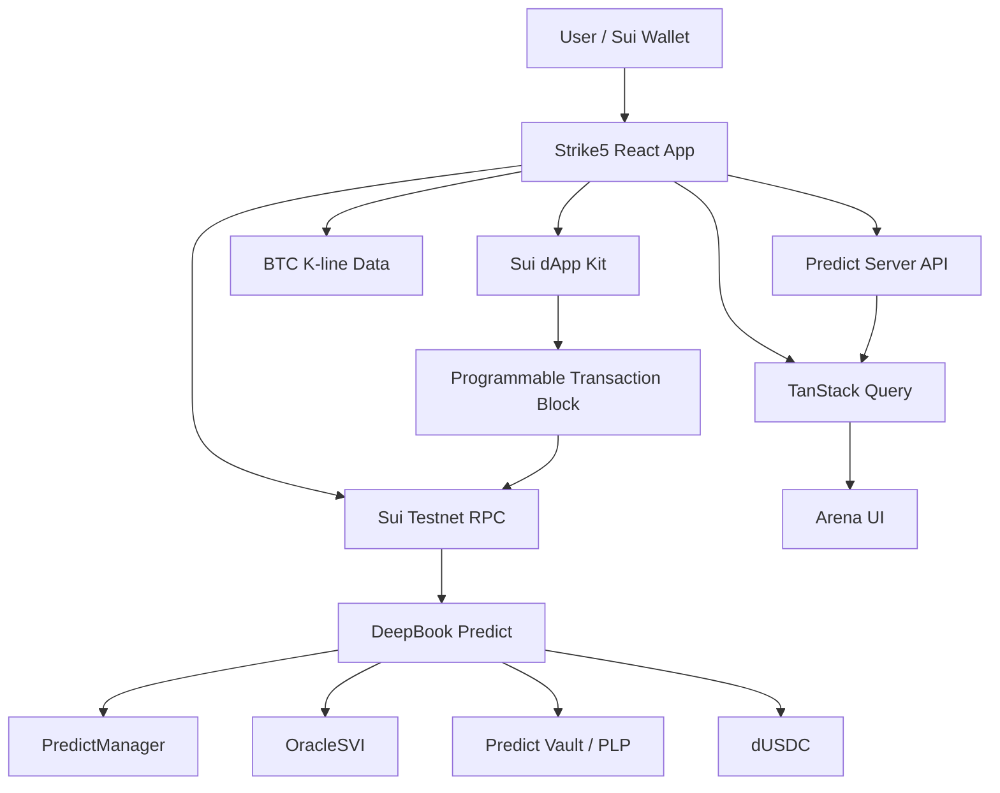

# Strike5

<p align="center">
  
</p>


**Strike5 is a short-cycle BTC prediction arena powered by DeepBook Predict on Sui.**

Users open fixed-risk BTC positions, track live PnL, cash out before expiry, or hold to oracle settlement. Around that trading loop, Strike5 adds a lightweight arena layer: streak combos, opt-in leaderboard, and verified social posts.

## Overview

DeepBook Predict provides programmable prediction markets with oracle-driven BTC rounds, dUSDC quote liquidity, PredictManager accounts, and vault-backed pricing. Strike5 turns that protocol surface into a consumer-facing trading arena.

The project is intentionally focused on the current official Predict testnet surface:

- BTC as the supported underlying.
- dUSDC as the quote asset.
- Real Sui wallet signing.
- Real DeepBook Predict mint, redeem, and settlement flows.
- Product-layer arena mechanics built on top of real position state.

## Product Loop

```text
Connect wallet
-> choose BTC direction or range
-> review DeepBook Predict quote
-> sign Sui transaction
-> track position and live PnL
-> cash out early or hold to settlement
-> update streak, leaderboard, and feed state
```

## Architecture



## Core Features

- **Trading Arena:** BTC chart, oracle spot, active round countdown, Above / Below / Range positions, custom strike/range builder, quote preview, and wallet-signed orders.
- **Position Lifecycle:** open positions, live mark/redeem value, early cash-out, settled redemption, and Sui explorer links.
- **Streak Combo:** 3-leg arena streak scoring built from real opened positions.
- **Opt-In Leaderboard:** users are hidden by default; public stats only show after opt-in.
- **Arena Feed:** users can publish market views and attach verified position snapshots.
- **Sealed Calls:** local commitment-based private calls for the MVP, with a path toward Sui Seal-backed privacy.

## DeepBook Predict Integration

Strike5 integrates DeepBook Predict on Sui testnet through:

- Predict Server API for oracle, vault, manager, and indexed position data.
- Sui RPC for transaction submission and confirmation.
- PredictManager account flow for user balances and positions.
- `predict::mint`, `predict::mint_range`, and redeem paths for real position lifecycle.

Configuration lives in `src/config/predict.ts`.

## Tech Stack

- React 19
- TypeScript
- Vite
- Tailwind CSS
- TanStack Query
- Sui dApp Kit
- Mysten Sui SDK
- Lightweight Charts

## Getting Started

```bash
pnpm install
pnpm dev
```

Open the local app:

```text
http://localhost:5173
```

Useful checks:

```bash
pnpm typecheck
pnpm lint
pnpm build
```

## Demo Path

1. Connect a Sui testnet wallet.
2. Confirm dUSDC and PredictManager state.
3. Open a BTC Above, Below, or Range position.
4. Watch the position update from real Predict data.
5. Cash out early or wait for settlement.
6. Show the arena layer: streak, leaderboard, and feed.

## Project Status

Strike5 is a hackathon MVP for the DeepBook Predict track. The core trading flow is real on Sui testnet. Arena mechanics such as streaks, feed, leaderboard visibility, and sealed calls are product-layer features built around the underlying Predict position lifecycle.

## License

MIT. See [LICENSE](./LICENSE).
