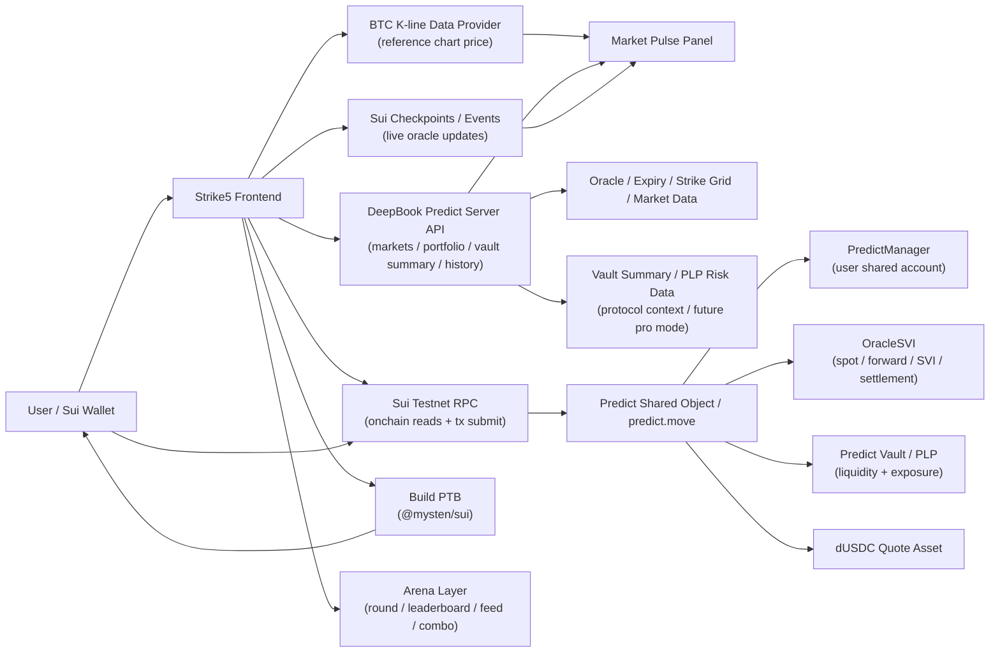
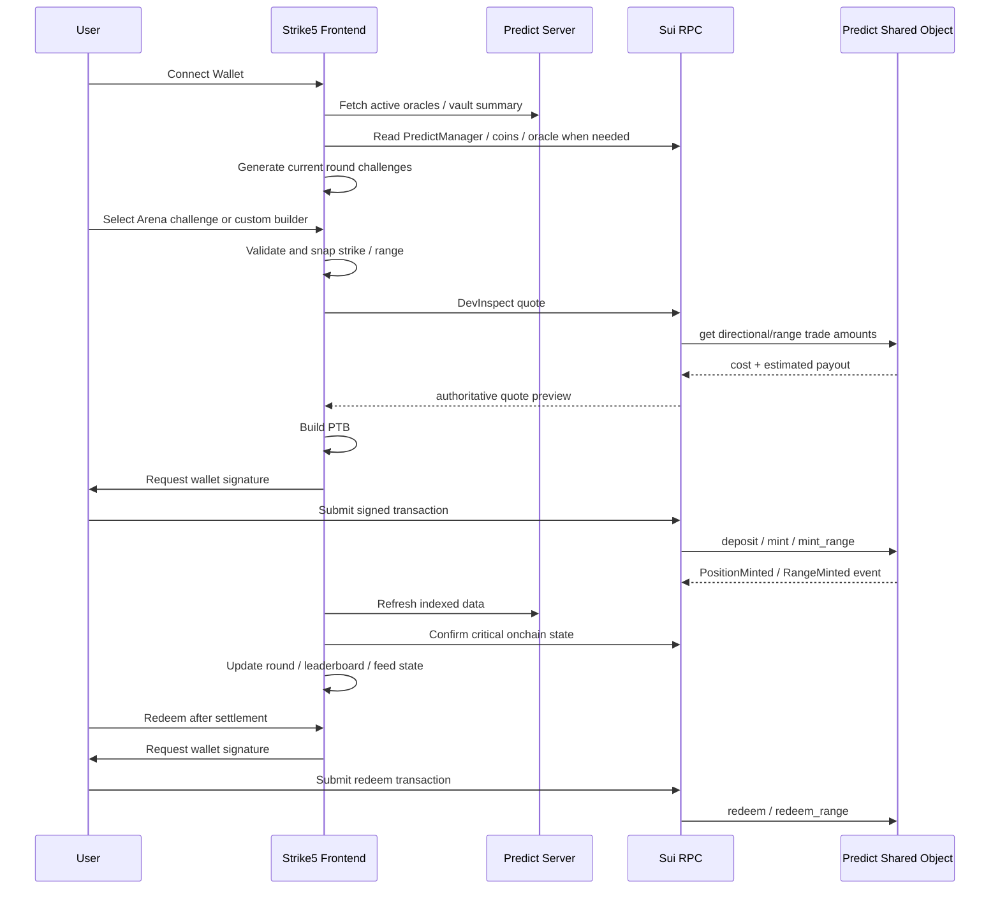

# Strike5 Technical Architecture

本文档定义 Strike5 Arena 的系统架构、数据分层、前端模块、交易路径和技术选型。

## 1. 架构原则

Strike5 Arena 的技术架构要满足三个目标：

1. 真实接入 DeepBook Predict。
2. 交易路径清晰，不把展示数据当成权威状态。
3. Arena / leaderboard / feed 玩法不能破坏真实 mint / redeem 闭环。

核心原则：

```text
Frontend builds PTB
Wallet signs PTB
Sui RPC submits transaction
Predict shared object executes
PredictManager records balances and positions
OracleSVI settles
User redeems
```

## 2. 总体架构图



## 3. 三层架构

### 3.1 展示数据层

展示数据层负责页面渲染和用户决策辅助。

数据来源：

- BTC K-line provider。
- DeepBook Predict Server API。
- Sui RPC polling。
- Sui checkpoints / events。

用途：

- K 线。
- active oracle。
- expiry countdown。
- oracle spot。
- vault summary, used as protocol context and future professional-mode data.
- portfolio summary, if the Predict Server endpoint and response shape are confirmed。
- historical data。
- transaction refresh。

注意：

```text
展示数据层不等于最终权威交易状态。
```

### 3.2 交易构造层

交易构造层由前端负责。

主要职责：

- 根据用户选择构造 MarketKey / RangeKey。
- 根据输入 amount 构造 quote 请求。
- 使用 devInspect 做交易前确认。
- 使用 `@mysten/sui` 构造 PTB。
- 调用钱包签名。
- 通过 RPC 提交交易。

正确路径：

```text
Frontend builds PTB
-> Wallet signs
-> RPC submits
-> Sui executes
```

不要写成：

```text
RPC builds PTB
```

RPC 不负责构造 PTB。

### 3.3 链上协议层

链上协议层是权威状态层。

核心对象：

- Predict shared object。
- PredictManager。
- OracleSVI。
- Predict Vault / PLP。
- dUSDC coin objects。

关键状态必须通过 Sui RPC 或交易结果确认：

- 用户是否有 PredictManager。
- 用户 dUSDC coin 是否足够。
- PredictManager balance。
- position quantity。
- oracle 是否 active / settled。
- transaction effects。
- emitted events。

## 4. 技术栈

| 模块 | 技术 | 用途 |
|---|---|---|
| Frontend | React + TypeScript | Arena UI |
| Wallet | `@mysten/dapp-kit` | Sui wallet connect |
| Sui SDK | `@mysten/sui` | PTB、RPC reads、devInspect、tx submit |
| Data Fetching | TanStack Query | oracle、vault、portfolio、quote 缓存 |
| Chart | TradingView Lightweight Charts | BTC K-line |
| Live Updates | Sui RPC polling / events / checkpoints | oracle 更新、交易刷新 |
| Market Data | DeepBook Predict Server API | market、oracle、vault、history 展示 |
| Protocol | DeepBook Predict | mint、mint_range、redeem、settlement |
| Quote Asset | dUSDC | Predict testnet quote asset |
| Privacy Stretch | Sui Seal | Sealed Calls 的观点内容加密与 reveal |
| Verified Compute Stretch | Nautilus | leaderboard scoring / attestable computation spike |

MVP 可以先做纯前端 dApp。只有在 K 线 provider 有 CORS、rate limit 或 API key 问题时，再增加一个很薄的 Node API 代理。

## 5. 前端模块

推荐模块划分：

```text
src/
  app/
  components/
    arena/
    chart/
    leaderboard/
    market-pulse/
    social-feed/
    trade-panel/
    positions/
  hooks/
  lib/
    deepbook/
    arena/
    sui/
    market-data/
  config/
```

### 5.1 Chart 模块

职责：

- 拉取外部 BTC K-line。
- 展示 1m / 5m / 15m candles。
- 绘制 oracle spot line。
- 绘制 selected strike line。
- 绘制 selected range band。
- 绘制 expiry marker。

Chart price 只用于参考，不用于最终结算。

### 5.2 Market Pulse 模块

职责：

- 显示 Chart Price。
- 显示 Oracle Spot。
- 显示 Chart / Oracle Diff。
- 显示 Oracle Freshness。
- 显示 1m / 5m / 15m change。
- 显示 current expiry / next expiry。

如果价格偏差过大，显示警告。

### 5.3 Arena / Challenge 模块

职责：

- 将当前 active BTC oracle expiry 映射为 current round。
- 生成 challenge cards。
- 将 challenge 映射到 MarketKey / RangeKey。
- 显示 round countdown / closed / settlement / reveal 状态。
- 显示 joined 状态。
- 触发 quote、mint 或 mint_range。

Challenge cards 可以复用现有 Trade Panel 的 quote 和 transaction builders。

### 5.4 Trade Builder 模块

Custom Builder 保留为高级入口。

包含：

```text
Challenge Cards
Custom
```

职责：

- 生成 Above / Below / Range cards。
- 接收用户输入。
- snap strike。
- 请求 quote。
- 展示 cost / payout / max loss。
- 触发 PTB 构造和钱包签名。

### 5.5 Positions 模块

职责：

- 根据 PredictManager 和 indexer 数据展示持仓。
- 区分 open / pending settlement / redeemable / redeemed。
- 触发 redeem / redeem_range。
- 支持 settlement reveal 和 showcase 生成。

注意：

```text
position 不一定是独立 object。
DeepBook Predict 当前设计中，仓位数量存在 PredictManager 内部。
```

### 5.6 Leaderboard 模块

职责：

- 管理用户 opt-in 状态。
- 展示 Top 10。
- 统计 completed rounds、win rate、streak 和 PnL。
- 默认不展示未 opt-in 用户。

MVP 可以先用应用层存储 opt-in 和 alias；战绩应尽量由 Predict Server events / PredictManager state 派生。

### 5.7 Social Feed / Sealed Calls 模块

职责：

- 发布 public call。
- 发布 verified showcase。
- 绑定 round、market key、tx digest 和 settlement result。
- 支持 sealed call 的 locked / revealed 状态。

如果接入 Sui Seal，模块负责 client-side encryption 和 policy-gated reveal。否则 UI 必须标注 demo-only，不得声称已完成真实加密。

### 5.8 Combo 模块

职责：

- 选择连续多个 round 的 challenge。
- 跟踪每个 leg 对应的真实 Predict position。
- 在全部 settlement 后计算 score multiplier。

Combo 不改变 DeepBook Predict 原生 payout。

### 5.9 Vault / PLP 协议数据

职责：

- 展示 vault summary。
- 展示 utilization。
- 展示 available liquidity。
- 展示 total max payout。
- 展示 PLP share price。
- 展示 oracle status / freshness。

这些数据用于向评委说明 DeepBook Predict 的真实流动性和风险池，也可以作为后续 professional mode 的扩展基础。MVP 主交易界面不再渲染独立 Vault & Oracle Health 面板，避免把 consumer demo 做成协议后台。

## 6. 数据源边界

### 6.1 Chart Price

Chart Price 来自外部 BTC/USD 行情源。

用途：

- K 线展示。
- 用户决策参考。
- 计算短周期涨跌幅。

不用于：

- DeepBook Predict quote。
- settlement。
- payout。

### 6.2 Oracle Spot

Oracle Spot 来自 DeepBook Predict OracleSVI。

用途：

- trade card 生成。
- quote 参考。
- settlement 参考。
- oracle freshness。

最终结算以 OracleSVI settlement price 为准。

### 6.3 Predict Server

Predict Server 用于页面渲染和 indexed data。

可用于：

- active oracle list。
- market data。
- vault summary。
- portfolio summary, if the public endpoint and response shape are confirmed。
- history。

不应单独作为关键交易状态的最终来源。

如果 portfolio summary endpoint 不稳定或未确认，Position Panel 应优先通过 PredictManager、交易 events 和 Sui RPC 确认关键状态。

### 6.4 Sui RPC

Sui RPC 用于权威确认。

用于：

- read objects。
- devInspect。
- submit transaction。
- get transaction effects。
- get events。
- confirm balances / positions。

## 7. 交易流程



## 8. Quote 策略

推荐策略：

```text
Predict Server for render-ready market data
devInspect / onchain read for authoritative pre-trade quote
```

交易确认页至少展示：

- trade type
- strike / range
- expiry
- time remaining
- cost
- estimated payout
- max loss
- oracle freshness
- chart/oracle diff

## 9. 错误与边界状态

前端必须处理：

- wallet not connected
- wrong network
- no dUSDC
- no PredictManager
- oracle inactive
- oracle stale
- pending settlement
- opening cutoff
- invalid strike
- invalid range
- insufficient PredictManager balance
- transaction rejected
- transaction failed
- indexer delay

## 10. MVP 架构总结

Strike5 是一个前端驱动的 Sui dApp：

```text
前端展示外部 BTC K 线、DeepBook Predict oracle spot、expiry 和 trade cards。
用户通过钱包签名 PTB。
PTB 调用 Predict shared object。
Predict 读写 PredictManager、OracleSVI、Vault 和 dUSDC。
仓位记录在 PredictManager 内部。
流动性和风险暴露由 Predict Vault / PLP 承担。
最终输赢以 OracleSVI settlement price 为准。
```
